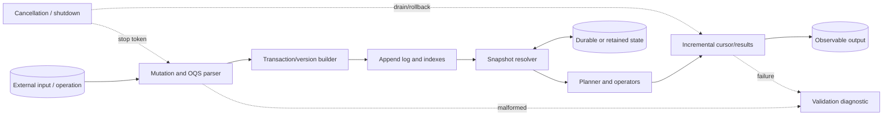
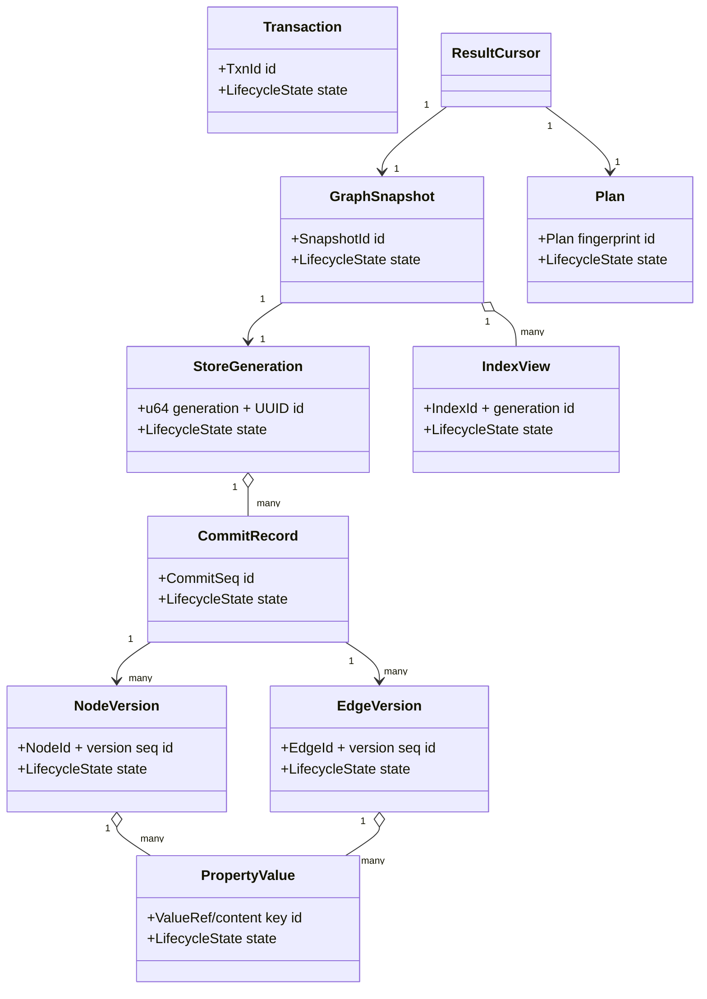
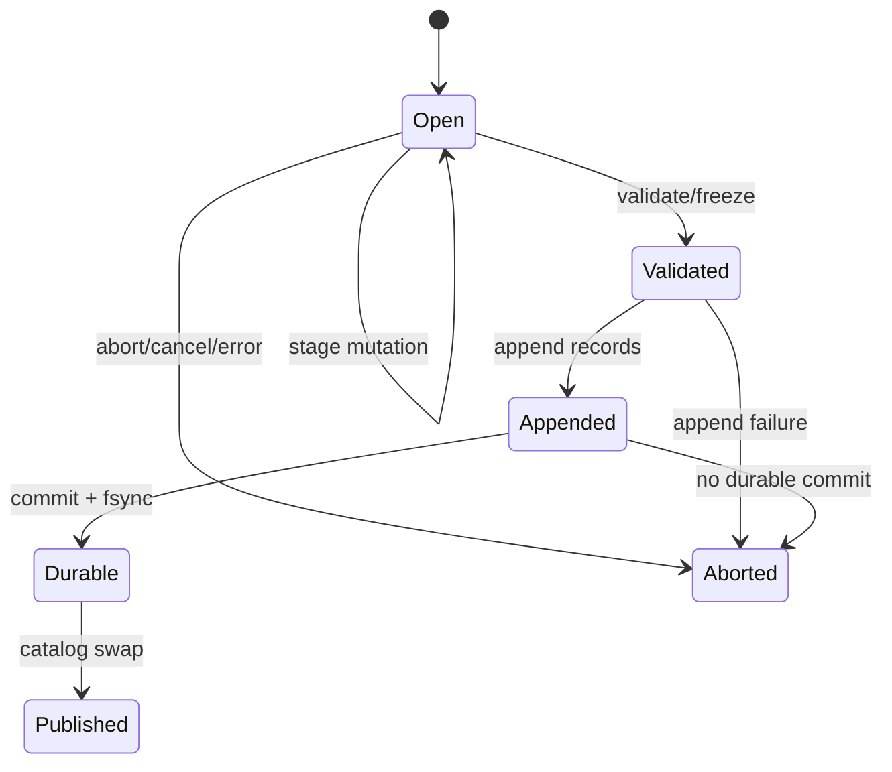
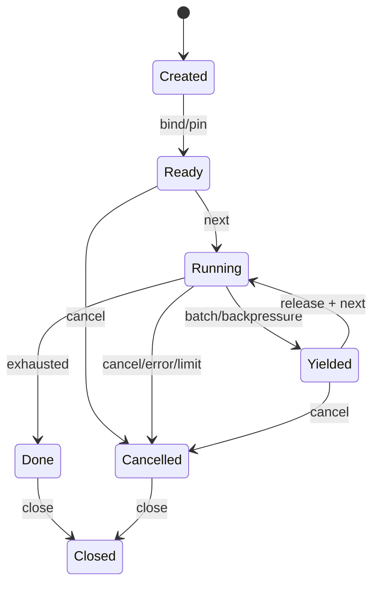
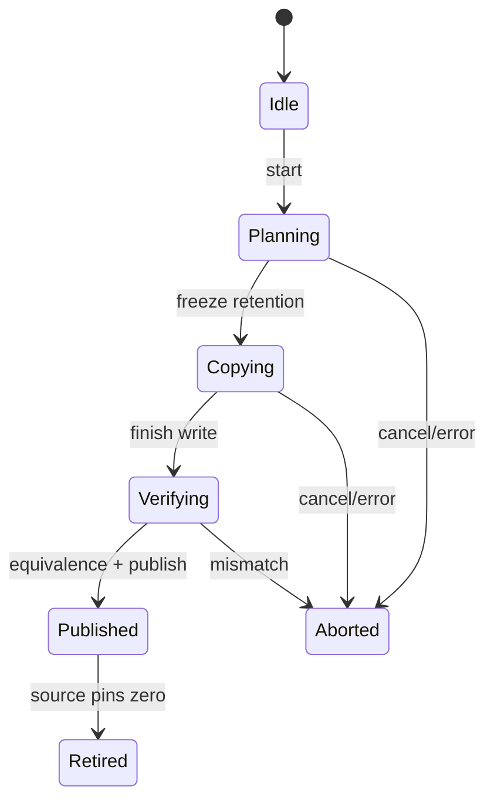

# 1. Project Identity

| Item | Specification |
| --- | --- |
| Name | Orbit — Temporal Property-Graph Query Engine |
| Description | A C++20 embedded engine that persists versioned nodes, edges, properties, and temporal intervals, serves immutable snapshots, plans original traversal queries, and streams incremental results. |
| Language | C++20 |
| Platforms | Linux x86-64 and AArch64; portable file adapter for later macOS/Windows support |
| Source size | MVP 10,000–14,000 lines; full 30,000–42,000 lines |
| Test size | 14,000–20,000 lines |
| License | Proprietary internal license with a documented binary-format patent review if commercialized |

**Substantial because:** Orbit combines append-oriented binary persistence, interval-aware version chains, multiple indexes, snapshot pinning, compaction, an original query grammar and planner, bounded path traversal, resumable result cursors, and reference-model differential testing.

# 2. Product Definition

**Problem/users:** Applications that need to ask “what relationships existed at time T?” often either flatten history into snapshots or depend on a full external database. Users: simulation and provenance developers, configuration-history tools, dependency-analysis systems, local research applications, and test platforms needing temporal graph fixtures

| Use case | Input | Result |
| --- | --- | --- |
| Configuration provenance | Versioned component and dependency mutations | A snapshot query explains which dependency path existed at an effective time. |
| Simulation timeline | Entities/relations with start and end intervals | Incremental traversal emits active neighbors and paths in stable order. |
| Impact analysis | A committed graph plus a property/index update batch | Queries compare snapshots before and after the transaction while compaction runs safely. |

- **Inputs:** transactional node/edge/property mutations, OGR-1 store files, original Orbit Query Script statements, snapshot time/commit selectors, limits, and cancellation tokens
- **Outputs:** committed snapshot IDs, streamed rows/paths, explain plans, diagnostics, canonical store/checkpoint files, compaction reports, and validation statistics
- **Observable behavior:** snapshot isolation, stable persistent IDs, deterministic row/path ordering, explicit temporal-boundary semantics, resumable bounded cursors, crash-safe reopen, and no mutation after a failed transaction
- **MVP:** single writer; immutable readers; nodes/edges with scalar properties and half-open valid-time intervals; label/property/adjacency indexes; point-in-time snapshots; one-hop and bounded path queries; OQS parser/planner; binary persistence and reopen; three fuzz targets
- **Full version:** multi-version commit snapshots, interval indexes, richer predicates, bidirectional/cost-aware paths, incremental result production under backpressure, compaction with relocation, background index building, checkpoint/recovery, subscriptions over committed changes, and bounded reader concurrency
- **Non-goals:** cloning Cypher, Gremlin, SPARQL, or another public query language; distributed consensus; remote server protocol; arbitrary user code; graph visualization UI; machine-learning graph analytics; or storing opaque external database pages
- **Originality:** Orbit separates commit time from valid time: each entity version has a commit visibility range and a user-declared half-open temporal interval.
- **Project-specific coverage:** The engine explicitly covers versioned nodes and edges; typed properties and temporal intervals; persistent IDs; snapshots and indexes; traversal planning and path queries; incremental result production; binary persistence and compaction; an original query syntax rather than a compatibility clone; and sequence fuzzing against a slower reference model.

# 3. Engineering Difficulty Profile

| Source | Why difficult | Invariant consequence |
| --- | --- | --- |
| Dual temporal dimensions | Commit visibility and valid-time intervals are related but not interchangeable. | A version may be visible in a snapshot yet inactive at the requested valid time; every index/traversal must apply both predicates. |
| Versioned mutation | Updating an entity appends a new immutable version and closes a prior visibility range. | Atomicity must cover entity chains, adjacency, property indexes, and commit catalog. |
| Traversal planning | Planner choices depend on label/property selectivity, direction, interval filtering, and path bounds. | A shallow full scan can violate latency/memory budgets and result ordering under incremental output. |
| Ownership and pinning | Store generations, pages/segments, snapshots, plan constants, cursor frontiers, and property values have distinct lifetimes. | Compaction/index replacement cannot invalidate a live snapshot or cursor. |
| Recovery and compaction | A crash may leave appended records, an incomplete commit, or a partially built replacement generation. | Only complete commit records become visible; old files remain until every snapshot pin is gone. |
| Path state | Cycles, repeated vertices, temporal edge activity, cost limits, cancellation, and result limits interact. | Traversal must represent frontier/visited/predecessor state safely and produce deterministic partial batches. |

**Cross-phase validation:** A persisted edge endpoint is bounds-checked while decoding, resolved to persistent IDs, filtered by snapshot visibility, filtered again by valid-time overlap, then used to construct traversal handles whose generations are revalidated before property materialization. Shallow framing-only or stateless implementations are incorrect.

# 4. System Architecture



- **Processes/threads:** The MVP has one serialized writer and any number of immutable readers in one process.
- **Normal path:** parse and validate mutations or OQS, reserve a transaction commit sequence, append entity/property/index deltas to a private generation, verify cross-index invariants, append and fsync a commit record.
- **Malformed path:** binary framing or required-feature errors reject open; a malformed query returns source-ranged diagnostics without creating a plan; invalid IDs/intervals/mutations abort the transaction before publication.
- **Cancel/shutdown:** reject new transactions/cursors, cancel background and query work, abort the uncommitted writer generation, drain cursor owners, release snapshots, join index/compaction workers, checkpoint if configured, then close store descriptors in generation order.
- **Recovery:** validate superblock copies, choose the highest generation whose commit catalog and segment digests agree, scan the append tail for complete transaction groups.

| Module | Responsibility | Input | Output | Owns | Invariant | Dependencies |
| --- | --- | --- | --- | --- | --- | --- |
| GraphStore | Coordinates open, snapshots, transactions, generations, and shutdown. | Paths/options/API calls | Store/snapshot/transaction handles | File set, catalogs, workers | Published commit sequence and store generation move monotonically. | SegmentManager, CommitLog, IndexCatalog |
| OgrCodec | Incrementally reads and canonically writes OGR-1 records. | File spans/record values | Validated record views/bytes | Bounded reader/writer scratch | No record reference is exposed before framing, CRC, and feature validation. | CheckedIO |
| SegmentManager | Owns append segments, mappings, page cache, and generation leases. | Record appends/locations | RecordHandle and mapped spans | FDs, mappings, cache entries | A RecordHandle resolves only in its pinned store generation. | OgrCodec, HandleRegistry |
| VersionStore | Stores immutable node/edge/property version chains. | Entity mutations/snapshot selectors | Visible entity versions | Version indexes and caches | At most one visible version per persistent ID at a commit snapshot. | CommitLog, IntervalOps |
| IndexCatalog | Owns label, property, adjacency, and temporal indexes by generation. | Index deltas/builds | IndexView leases | Index descriptors/files/cache | Each index declares commit coverage and semantic key version. | SegmentManager, VersionStore |
| TransactionBuilder | Validates and stages atomic graph mutations. | Put/delete/property/interval operations | Private transaction generation | Mutation map, reservations | Endpoints/IDs and derived indexes agree before commit. | VersionStore, IndexCatalog |
| SnapshotManager | Pins a commit/store generation and valid-time selector. | Commit/time request | Immutable GraphSnapshot | Snapshot registry/pins | All reads in a snapshot use one commit catalog and generation set. | GraphStore |
| Planner | Chooses deterministic scans, expands, filters, paths, and projections. | AST, snapshot/index stats | Immutable Plan | Plan arena/constants | Chosen operators preserve normative row order and snapshot predicates. | IndexCatalog, Operators |
| Operators | Execute scans, temporal filters, expansions, paths, sort/limit and projection. | Plan/Snapshot/frontier | Result batches | Cursor state, visited/frontier arenas | Every emitted row resolves against the cursor snapshot and passes all predicates. | VersionStore, IndexCatalog |
| Compactor | Rewrites retained versions/indexes into a new generation. | Retention policy/snapshot pins | Replacement generation/report | Reachability map, relocation tables | All retained snapshot semantics match before old generation retirement. | SegmentManager, IndexCatalog |

# 5. Proposed Repository Layout

```text
    orbit/
    ├── CMakeLists.txt
    ├── cmake/{Warnings.cmake,Sanitizers.cmake,FuzzTargets.cmake}
    ├── include/orbit/{store.hpp,transaction.hpp,snapshot.hpp,query.hpp,value.hpp,error.hpp}
    ├── src/base/{checked.cpp,id.cpp,value.cpp,arena.cpp}
    ├── src/format/{ogr_reader.cpp,ogr_writer.cpp,superblock.cpp}
    ├── src/store/{graph_store.cpp,segment_manager.cpp,commit_log.cpp,version_store.cpp}
    ├── src/index/{catalog.cpp,label_index.cpp,property_index.cpp,adjacency_index.cpp,interval_index.cpp}
    ├── src/txn/{transaction_builder.cpp,mutation_validate.cpp}
    ├── src/query/{lexer.cpp,parser.cpp,semantic.cpp,planner.cpp}
    ├── src/query/operators/{scan.cpp,expand.cpp,path.cpp,filter.cpp,project.cpp,sort_limit.cpp}
    ├── src/snapshot/{snapshot_manager.cpp,cursor.cpp}
    ├── src/compact/{retention.cpp,rewriter.cpp,publish.cpp}
    ├── src/cli/{main.cpp,cmd_init.cpp,cmd_apply.cpp,cmd_query.cpp,cmd_check.cpp,cmd_compact.cpp}
    ├── tests/unit/{format_tests.cpp,interval_tests.cpp,parser_tests.cpp,operator_tests.cpp}
    ├── tests/integration/{transactions.cpp,snapshots.cpp,paths.cpp,recovery.cpp,compaction.cpp}
    ├── fuzz/{fuzz_ogr_parser.cpp,fuzz_graph_sequence.cpp,fuzz_query_pipeline.cpp}
    ├── tools/{orbit_dump.cpp,orbit_model_compare.cpp,orbit_fixture.cpp}
    ├── examples/{embedded_history.cpp,incremental_cursor.cpp}
    ├── docs/{ARCHITECTURE.md,OGR_FORMAT.md,OQS_LANGUAGE.md,RECOVERY.md}
    ├── corpus/{ogr,sequences,queries}/
    └── scripts/{run_fuzz.sh,crash_matrix.py,benchmark.py}
```

| Important file | Purpose |
| --- | --- |
| `include/orbit/store.hpp` | Opaque store, snapshot, transaction, and generation ownership API. |
| `src/format/ogr_reader.cpp` | Only production binary framing and record decoder. |
| `src/store/version_store.cpp` | Commit/valid-time visibility and version-chain invariants. |
| `src/query/planner.cpp` | Deterministic physical-plan selection and explain reasons. |
| `src/query/operators/path.cpp` | Bounded incremental path frontier/visited state. |
| `docs/OQS_LANGUAGE.md` | Normative original grammar, types, ordering, and examples. |

Tests and fuzzers link production libraries; no duplicate decoder/state logic.

# 6. Core Data Model

| Entity | Role | Ownership | Mutability | Stable ID | Thread safety |
| --- | --- | --- | --- | --- | --- |
| StoreGeneration | Immutable set of segments/indexes/catalog | Owned by GraphStore and pinned by snapshots | Immutable after publish | u64 generation + UUID | Thread-safe |
| CommitRecord | Atomic mutation boundary and parent commit | Owned by CommitLog/segment | Immutable | CommitSeq | Thread-safe through generation |
| NodeVersion | Versioned node label/properties/interval | Owned by VersionStore segment | Immutable | NodeId + version seq | Snapshot-readable |
| EdgeVersion | Versioned directed edge/endpoints/type/properties/interval | Owned by VersionStore segment | Immutable | EdgeId + version seq | Snapshot-readable |
| PropertyValue | Typed scalar/list value with canonical encoding | Inline or segment-owned blob | Immutable | ValueRef/content key | Snapshot-readable |
| IndexView | Generation/coverage-pinned index reader | Owned by GraphSnapshot/Plan | Immutable | IndexId + generation | Thread-safe |
| Transaction | Private ordered mutation map and reservations | Unique owner | Mutable until commit/abort | TxnId | Writer-thread confined |
| Plan | Typed immutable operator tree and constants | Shared immutable owner | Immutable | Plan fingerprint | Thread-safe |
| ResultCursor | Operator state, frontier, batch arena and snapshot pin | Unique owner; movable | Mutable until done/cancelled | CursorId + generation | Single-consumer |



**Lifecycles/serialization:** Transactions move `Open → Validated → Appended → Durable → Published` or `Aborted`; only Published creates snapshots. Invalid/transitional states are explicit; cache-only fields never serialize.

# 7. Custom Format or Protocol Specification

## OGR-1 Orbit Graph Record store

| Rule | Definition |
| --- | --- |
| Magic | `OGR1` |
| Endian | little-endian fixed fields; canonical strings are UTF-8 byte sequences with no implicit normalization |
| Integers | u8/u16/u32/u64 and i64 fixed; unsigned LEB128 for list/count fields, signed zigzag for compact integer property values; canonical varints are minimal and at most 10 bytes |
| Alignment | 4 KiB superblock copies; segment headers 64-byte aligned; records 8-byte aligned with zero padding; blob payload alignment declared by record flag |
| Versioning | major/minor plus required/optional store features and per-record schema version; readers reject unknown required semantics but may skip CRC-valid optional records |
| Integrity | CRC32C per record, digest per transaction group and segment footer, two generation-stamped superblock copies; checksums cover encoded bytes including canonical padding rules |
| Depth | property nesting 16, query AST 128, path bound configurable hard max 1024, operator stack explicit |
| Canonical | minimal varints, sorted property keys, half-open intervals `[start,end)`, stable record order within transactions, zero padding, canonical IEEE finite numbers with one NaN policy |
| Unknown | unknown optional metadata/index record is skipped; unknown required entity, transaction, or semantic-index record makes that generation unreadable |
| Truncation | only complete CRC-valid transaction groups ending in TXN_COMMIT are visible; incomplete segment tail is ignored after diagnostic during reopen |

### Header/footer and framing

| Field | Encoding | Constraint | Meaning |
| --- | --- | --- | --- |
| magic | 4 bytes | `OGR1` | Store discriminator. |
| major/minor | u16/u16 | major 1 | Compatibility. |
| header_bytes | u32 | 4096 | Superblock copy size. |
| store_uuid | 16 bytes | Stable nonzero | Persistent store identity. |
| generation | u64 | Monotonic | Published store generation. |
| latest_commit | u64 | 0 or valid CommitSeq | Snapshot head. |
| segment_catalog_offset | u64 | Aligned/within file | Catalog root. |
| index_catalog_offset | u64 | 0 or valid record | Index generations. |
| required/optional_features | u64/u64 | Reader-checked | Semantic capabilities. |
| superblock_crc32c | u32 | Covers copy except field | Integrity/torn-write choice. |

Segments begin with `{segment_id,generation,first_commit,flags}`. Records use `{u16 type,u16 schema,u32 flags,u64 payload_len,u64 logical_id,u64 commit_seq,u32 header_crc,u32 payload_crc,payload,padding}`. Transaction records are contiguous from TXN_BEGIN through entity/index deltas to TXN_COMMIT. Offsets are absolute file offsets and checked against segment bounds.

#### Store publication and segment termination

OGR-1 has no single file footer. Two fixed superblock copies publish a generation, while transaction commits and checkpoints delimit valid segment content.

| Publication element | Encoding | Constraint | Meaning |
| --- | --- | --- | --- |
| superblock copy A/B | 4096 bytes each | CRC valid; generation monotonic; catalog offsets aligned and in bounds | Highest valid copy selects the visible store generation. |
| `TXN_COMMIT` | framed record with commit sequence, group digest, and catalog deltas | Names a contiguous complete transaction group | Makes node, edge, property, and index versions atomically visible. |
| `CHECKPOINT` | framed record containing catalog/version roots and digest | All roots resolve within committed generations | Bounds recovery scanning. |
| `COMPACTION_MAP` | framed record with old/new generations and retained commit coverage | Complete for every retained snapshot | Proves replacement-generation equivalence before superblock swap. |
| segment EOF | no bytes | Valid only after a complete record; incomplete tail is ignored or repaired | Never publishes an uncommitted transaction. |

Physical offsets are generation-local hints; persistent entity IDs, commit sequences, and snapshot pins remain the semantic identities.

| Type | Code | Payload | Constraints | Semantics |
| --- | --- | --- | --- | --- |
| TXN_BEGIN | 0x0001 | Txn ID, parent commit, mutation count/limits | Parent is current writer base | Starts private atomic group. |
| NODE_VERSION | 0x0010 | Node ID, label, commit visibility, valid interval, properties | Sorted unique properties; interval valid | Creates/updates/tombstones node. |
| EDGE_VERSION | 0x0011 | Edge ID, endpoints, type, visibility, valid interval, properties | Endpoints IDs valid by commit policy | Creates/updates/tombstones edge. |
| PROPERTY_BLOB | 0x0012 | Value key, canonical typed bytes | Digest/size/type valid | Deduplicated large value. |
| ADJ_DELTA | 0x0020 | Node/direction/type and edge add/remove list | Matches entity mutations | Adjacency index delta. |
| VALUE_INDEX_DELTA | 0x0021 | Label/property/value and entity refs | Canonical key order | Property index delta. |
| INTERVAL_INDEX_DELTA | 0x0022 | Interval endpoints/entity refs | Half-open normalized | Temporal accelerator delta. |
| TXN_COMMIT | 0x0030 | Commit seq, group digest, catalog deltas | All declared records present | Makes group eligible for publication. |
| CHECKPOINT | 0x0040 | Commit catalog/version roots and digest | References complete records | Recovery acceleration. |
| COMPACTION_MAP | 0x0050 | Old/new generation and retained commit coverage | Complete bijection for retained refs | Replacement-generation verification. |

### Examples and streaming behavior

- **Valid 1:** TXN 7 creates nodes 100 `Service` and 101 `Database`, then edge 900 `DEPENDS` active `[20,80)`; `AT COMMIT 7 TIME 40 FROM Service STEP OUT DEPENDS YIELD node.id` returns 101.
- **Valid 2:** TXN 8 appends a new version of edge 900 with valid interval `[20,50)` and property `tier="critical"`; snapshots at commits 7 and 8 deliberately return different temporal results without mutating old bytes.

- **Malformed 1:** NODE_VERSION has interval end less than start: abort the transaction group; no entity or index delta is published.
- **Malformed 2:** EDGE_VERSION payload ends inside a property value or references an endpoint forbidden by transaction policy: reject group with record/field diagnostic.
- **Malformed 3:** TXN_COMMIT digest excludes a declared ADJ_DELTA: ignore the incomplete/corrupt transaction and expose the preceding commit only.
- **Malformed 4:** COMPACTION_MAP claims retained commit coverage but omits a reachable property blob: reject replacement generation and keep old catalog active.

- **Partial input:** Open reads fixed superblock copies, then segment/record headers incrementally. Records may be larger than memory: property blobs stream through digest validation to a bounded sink, while entity headers/properties are size-capped. A transaction is accumulated as validated record locations and semantic summaries, then published only after TXN_COMMIT verification. Query text is independently tokenized from arbitrary UTF-8 chunks for CLI/IPC embedding.

# 8. State Machines and Lifecycle Rules

### Transaction append, durability, and publication

**Scope:** TransactionBuilder, VersionStore, index delta builders, CommitLog, SegmentManager, and GraphStore catalog.

| From | Event | Guard | Action | To |
| --- | --- | --- | --- | --- |
| Open | mutation | ID/type/interval/value valid and quota reserved | stage latest mutation and derived index intents | Open |
| Open | validate | endpoints/cycles policy/index deltas consistent | freeze canonical mutation order and digest plan | Validated |
| Validated | append | writer generation current | write TXN_BEGIN/entity/index records | Appended |
| Appended | commit record + fsync | record counts/digest agree | append TXN_COMMIT and durably flush data | Durable |
| Durable | publish catalog | superblock generation compare succeeds | atomically publish latest commit/catalog | Published |
| Open | abort/cancel/error | always | release reservations and private values | Aborted |
| Validated | error/cancel | always | leave any uncommitted tail unreachable | Aborted |
| Appended | crash/error | no valid commit/publish | tail remains invisible on reopen | Aborted |



- **Illegal transitions:** mutating after freeze, publishing before durable commit, deriving indexes from a different mutation view, reusing a commit sequence, or exposing an Appended transaction to snapshots.
- **Cancellation:** before publication, cancellation aborts visibility; after publication, cancellation only affects caller notification and the commit remains successful.
- **Timeout:** writer admission/flush may time out before publication and return aborted/unknown-durability status that reopen resolves by CommitSeq.
- **Recovery:** reopen scans only complete groups, validates parent sequence/digest/index summaries, and may republish a durable commit if the policy records an unambiguous catalog candidate.
- **Transition invariants:** one visible version per entity at a commit; all derived indexes describe exactly the published mutation set; latest_commit never points to an incomplete group.

### Incremental query cursor and snapshot lifecycle

**Scope:** OqsParser, Planner, GraphSnapshot, IndexViews, Operators, result batches, cancellation, and compaction pins.

| From | Event | Guard | Action | To |
| --- | --- | --- | --- | --- |
| Created | bind snapshot/parameters | types and commit/time selectors valid | pin generation/indexes and instantiate plan state | Ready |
| Ready | next | not cancelled and batch budget available | run operators until batch/full/end/checkpoint | Running |
| Running | batch full/backpressure | rows own batch values | freeze batch and continuation frontier | Yielded |
| Yielded | batch released + next | cursor generation unchanged | reset batch arena and resume frontier | Running |
| Running | operators exhausted | frontier empty | release operator temporaries; retain summary | Done |
| Ready | cancel | always | mark sticky cancellation and release work | Cancelled |
| Running | cancel/limit/error | always | discard partial unpublished row; store terminal diagnostic | Cancelled |
| Done | close | all batches released | release plan/index/snapshot pins | Closed |
| Cancelled | close | all batches released | release plan/index/snapshot pins | Closed |



- **Illegal transitions:** reading indexes from another generation, emitting a row after cancellation, resuming before prior batch release, retaining a raw index iterator across yield, or compacting away pinned records.
- **Cancellation:** sticky; operator loops poll at bounded work intervals, discard the current incomplete row/path, and preserve earlier delivered batches as valid.
- **Timeout:** implemented as cancellation from a caller clock; deterministic core uses a work-unit budget rather than wall time.
- **Recovery:** queries are not durably resumed in the MVP; a reproducer stores query, parameters, snapshot selectors, and delivered row count.
- **Transition invariants:** every row/path entity is visible at the pinned commit and active under the query time predicate; row order and continuation key are stable; pins outlive batches.

### Compaction generation build and retirement

**Scope:** Retention planner, Compactor, SegmentManager, IndexCatalog, SnapshotManager, and atomic catalog publisher.

| From | Event | Guard | Action | To |
| --- | --- | --- | --- | --- |
| Idle | start | retention policy valid and disk budget reserved | capture source generation/commit coverage | Planning |
| Planning | plan complete | all pinned/retained snapshots represented | freeze reachability/version retention set | Copying |
| Copying | records/indexes written | source handles still pinned | build relocation and semantic verification summaries | Verifying |
| Verifying | equivalence passes | all retained snapshots/query probes match | fsync replacement and publish catalog generation | Published |
| Published | old pins zero | no snapshot/cursor references source | delete/retire old segments | Retired |
| Planning | cancel/error | always | delete unpublished replacement | Aborted |
| Copying | cancel/error | always | delete unpublished replacement | Aborted |
| Verifying | mismatch | always | quarantine replacement; retain source | Aborted |



- **Illegal transitions:** deleting source before pins zero, changing retention after copying starts, publishing incomplete indexes, or translating a handle without source/target generation.
- **Cancellation:** unpublished replacement files are closed and removed; source generation remains authoritative.
- **Timeout:** work pauses/cancels at record/index checkpoints; no partially published generation exists.
- **Recovery:** reopen chooses only a superblock-published replacement whose segment/index/compaction digests all validate; otherwise it keeps the source generation.
- **Transition invariants:** all retained commit/time query semantics are equal before publication; relocation covers every reachable record; generation pins are balanced.

# 9. Memory Ownership and Resource Management

RAII is mandatory for file descriptors, mappings, heap buffers, locks, queue leases, plugin instances, and transactional scopes. `std::unique_ptr` is the default owner; `std::shared_ptr` is restricted to explicitly shared immutable snapshots or plugin code objects. Raw pointers and references are non-owning observers whose lifetime is bounded by a call or documented guard object.

| Concern | Rule |
| --- | --- |
| Allocation domains | store generation descriptors, mapped segment/cache pages, transaction mutation arenas, decoded value blobs. |
| Transfer | transaction consumes mutation values; commit writer moves frozen encoded buffers; ResultBatch owns materialized values until release. |
| Borrowing/slices | record/property spans borrow a SegmentLease; entity views borrow GraphSnapshot; AST source spans borrow QueryText owner. |
| Shared ownership | StoreGeneration, GraphSnapshot, Plan, immutable index pages and interned values may be shared; Transaction and ResultCursor remain unique mutable owners |
| Arenas/pools | AST/plan allocated per parse/plan; transaction arena drops on abort; cursor has persistent frontier arena plus resettable batch arena. |
| Handles | NodeId/EdgeId never recycled within store UUID; RecordHandle and IndexHandle include generation; CursorId and batch generation reject stale release/resume; CommitSeq monotonic |
| Iterator invalidation | index iterators are invalidated by IndexView release, not newer commits; cursor never exposes them. |
| Reallocation | vectors reserve before publishing offsets; internal references use indices/IDs, not vector element pointers. |
| Plugins/callbacks | no execution plugins in core. |
| Thread handoff | read tasks receive shared snapshot/plan and owned cursor partition; only one consumer mutates a cursor. |
| Eviction/snapshots | page/index caches remove lookup visibility then wait for leases; old store generations retire only after snapshots/cursors/batches release. |
| Mappings/files | SegmentManager RAII owns descriptors/mappings; a mapped span is available only through `SegmentLease` |
| Unwinding | transaction/commit/compaction scopes are RAII rollback guards; publication disarms only after catalog swap. |
| Shutdown | stop writers/background builds, cancel cursors, wait/reject outstanding batches by API policy, release snapshots/plans, retire cache entries, join workers, close generation mappings/files |

Every retained observer is protected by an owner/lease and stable generation; raw addresses are never durable identities.

# 10. Core Algorithms

### 1. Snapshot-visible entity version lookup

**Purpose/I/O:** Resolve one persistent ID under commit and valid-time predicates. GraphSnapshot, NodeId/EdgeId, optional valid-time point/range → EntityView or absent.
**Preconditions:** Snapshot generation and ID namespace valid.
**Procedure:** `locate version-chain head through ID index → binary/skip search for newest version with begin_commit <= snapshot commit → verify end_commit is open or greater than snapshot commit → reject tombstone → intersect entity valid interval with query temporal selector → return view holding snapshot/segment lease`
**Complexity/failures:** O(log v) target per ID, where v versions.; corrupt chain, generation mismatch, unsupported value feature, cancellation during cold I/O.
**Interactions/invariant:** VersionStore, IndexView, Operators.; at most one version returned; returned record and properties belong to pinned generation and satisfy both temporal dimensions.

### 2. Atomic mutation canonicalization and index delta derivation

**Purpose/I/O:** Freeze an unordered operation batch into one deterministic transaction. Transaction mutation map and base snapshot → ordered entity records and index deltas.
**Preconditions:** Transaction open, base is writer head or explicit conflict policy.
**Procedure:** `coalesce repeated operations by persistent ID → validate labels/types/property names/intervals → resolve endpoint and prior visible versions → compute old/new label/property/adjacency/interval keys → emit remove/add deltas in canonical key order → check counts/reservations and cross-index summaries → freeze transaction digest inputs`
**Complexity/failures:** O(m log m + changed properties), m entities.; conflict, missing endpoint, invalid interval/value, quota, cancellation.
**Interactions/invariant:** TransactionBuilder, VersionStore, IndexCatalog, CommitLog.; applying deltas to base indexes yields exactly the new visible entity set; no duplicate canonical key/entity pair.

### 3. OQS parse and semantic binding

**Purpose/I/O:** Turn original query text into a typed snapshot-relative AST. UTF-8 query and parameters → AST or ranged diagnostics.
**Preconditions:** Query/AST/nesting limits configured.
**Procedure:** `tokenize names/literals/punctuation with byte ranges → parse `AT` selector, source pattern, STEP/PATH clauses, WHERE and YIELD → build explicit AST with no implicit recursion beyond cap → resolve variables/labels/types/property keys → infer value/predicate types and constant-fold safe expressions → normalize defaults and compute semantic fingerprint`
**Complexity/failures:** O(query bytes + AST nodes).; invalid UTF-8/token, syntax, unknown variable, type mismatch, depth/work limit.
**Interactions/invariant:** Planner, plan cache, CLI diagnostics.; every AST node has source range; no unresolved symbol reaches planner; normalization preserves stated semantics.

### 4. Deterministic access-path planning

**Purpose/I/O:** Choose scans/expansions/path strategy while preserving normative order. Bound AST, GraphSnapshot, index coverage/stats, limits → immutable physical Plan.
**Preconditions:** All referenced index semantics compatible with snapshot.
**Procedure:** `enumerate label/property/ID starting candidates → estimate rows using bounded persisted stats with conservative fallback → enumerate legal direction/type expansion orders → insert commit/valid-time filters at each entity boundary → choose path algorithm from bound/cost/simple-path policy → add stable order/tie key and projection → select minimum cost with canonical tie-break and record explain reasons`
**Complexity/failures:** Polynomial in small clause count; hard candidate cap.; no legal bounded plan, incompatible index, resource estimate exceeds policy.
**Interactions/invariant:** IndexCatalog, Operators, explain output.; plan cannot omit temporal filters or alter specified order; same catalog/stats/query yields same fingerprint.

### 5. Incremental adjacency expansion

**Purpose/I/O:** Produce neighbors in stable batches without retaining invalid iterators. Input row, expansion operator state, snapshot → output rows.
**Preconditions:** Input node visible and operator index coverage valid.
**Procedure:** `open adjacency cursor keyed by node/direction/type → seek continuation key stored as value not pointer → read bounded candidate IDs → resolve edge and opposite node visibility/valid-time → apply edge/node predicates → materialize output row into batch arena → store next canonical key before yield/end`
**Complexity/failures:** O(log d + candidates × lookup), streaming memory O(batch).; corrupt index reference, resource/cancel, value materialization error.
**Interactions/invariant:** IndexView, VersionStore, ResultCursor.; no duplicate candidate key; every row passes both edge/node predicates; resume key advances monotonically.

### 6. Bounded temporal path traversal

**Purpose/I/O:** Find and stream paths under hop, direction/type, cost, time, cycle, and result bounds. Seed rows, path specification, snapshot → path rows incrementally.
**Preconditions:** Finite hop bound; cost nonnegative for priority mode; frontier budgets configured.
**Procedure:** `initialize frontier entries with stable path keys → pop BFS queue or `(cost,path_key)` heap → check cancellation/work/result limits → expand edges through temporal adjacency operator → apply repeated-node policy using per-path compact ancestry or global visited key → record predecessor node with snapshot-safe IDs → when endpoint predicate matches materialize path into batch → persist frontier indices/keys at yield`
**Complexity/failures:** O(V+E) within explored bounded subgraph for BFS; O((V+E) log V) for cost mode; hard memory cap.; frontier/visited/path length limit, negative/NaN cost, cancellation, corrupt index.
**Interactions/invariant:** Planner, Operators, batch arena, snapshot pins.; all path members are snapshot-visible and temporally active; tie/order deterministic; predecessor references remain valid until cursor closes.

# 11. Public API and Tooling Interfaces

```text
Result<GraphStore> GraphStore::open(const path&, OpenOptions);
Result<Transaction> GraphStore::begin(TransactionOptions = {});
Result<CommitSeq> Transaction::commit(CancelToken = {});
Result<GraphSnapshot> GraphStore::snapshot(SnapshotSelector);
Result<PreparedQuery> GraphStore::prepare(std::string_view oqs);
Result<ResultCursor> PreparedQuery::execute(GraphSnapshot, Parameters, QueryLimits);
Result<std::optional<ResultBatch>> ResultCursor::next(std::size_t row_budget, CancelToken);
```

| Command | Purpose | Example |
| --- | --- | --- |
| `orbit init` | Create an empty OGR store. | `orbit init graph.ogr` |
| `orbit apply` | Apply a deterministic mutation script. | `orbit apply graph.ogr changes.oms --commit-label sprint-4` |
| `orbit query` | Execute OQS at a commit and valid time. | `orbit query graph.ogr "AT COMMIT HEAD TIME 42 FROM Service STEP OUT DEPENDS YIELD node.id"` |
| `orbit explain` | Show typed AST, index coverage, estimates and operator plan. | `orbit explain graph.ogr query.oqs --at 120` |
| `orbit check` | Validate committed records, versions and indexes. | `orbit check graph.ogr --deep` |
| `orbit compact` | Build/publish a retained replacement generation. | `orbit compact graph.ogr --keep-last 20 --keep-time 0:1000` |

- **Configuration:** versioned open/query/transaction limits define page/cache sizes, max values/depth/hops/frontier/results, durability, index policy, retained commits/times, deterministic scheduler, and recovery mode; no semantic default depends on locale or wall time
- **Exit codes:** `0` success, `2` usage/config, `3` rejected input, `4` limit, `5` cancelled, `6` documented partial result, `10` invariant failure.
- **Errors/logging:** Format, Integrity, Unsupported, QuerySyntax, QueryType, Conflict, NotFound, Temporal, Index, ResourceLimit, Backpressure, Cancelled, Io, InternalInvariant. Logs carry stable code/component and only validated IDs, ranges, and offsets.
- **Stability/versioning:** persistent ID/value types, snapshot isolation, OQS core clauses, error codes, and OGR major-version rules stabilize first; planner explain details, subscriptions, and optional indexes remain experimental Tool semantic versioning is independent from Section 7 format compatibility; no pre-1.0 ABI promise.

# 12. Error Model and Defensive Behavior

Errors include stable code, store/generation/commit, entity/index/record ID when validated, query source range/operator ID, and recovery action. Checked arithmetic precedes every allocation/offset/time conversion. Maximum single allocation: 32 MiB single allocation, 512 MiB default process cache, and explicit transaction/value/frontier/visited/batch/compaction budgets. Explicit stacks enforce nesting caps. Cancellation is sticky; partial results carry completeness/trust; cleanup and deterministic diagnostics are mandatory.

# 13. Concurrency Model

One serialized writer publishes immutable commits.

| Concern | Design |
| --- | --- |
| Workers/loops | writer/commit loop, bounded query pool, one index builder, one compaction worker, optional asynchronous I/O prefetcher |
| Queues | bounded transaction requests, query tasks, and generation publication messages; cursor row delivery is pull-based for natural backpressure |
| Handoff | shared immutable GraphSnapshot/Plan plus unique cursor partitions or owned result batches; writer/compactor transfers only frozen validated generation objects |
| Locks | GraphStore lifecycle → commit catalog → generation registry → cache shard. |
| Lock-free | atomic latest snapshot pointer and cancellation flags are reasonable. |
| Backpressure | writer admission reserves log/index bytes; cursor `next` is bounded by requested batch; background builds pause/cancel on disk/cache pressure |
| Shutdown | reject writes/queries, cancel cursors/background jobs, wait for result batches per close policy, abort private generations, release snapshots, join workers, close caches/segments |
| Determinism | serial query oracle, fixed stats snapshots/hash seeds, canonical planner ties, logical work budgets, sorted compaction/index output, no wall-clock values in store |
| Not thread-safe | Transaction, OqsParser builder, Planner builder, ResultCursor/operator state, transaction writer, and compactor scratch |

# 14. Fuzzing Architecture

Harnesses map bytes to production entry points and state machines; only operation decoding is harness-specific.

### Harness 1: `orbit_ogr_parser_fuzz`

- **Entry/input:** `OgrReader::feed(ByteSpan)` / `open_generation()`; raw OGR bytes with optional read-split and superblock-choice mutations
- **Setup/state:** memory file adapter, strict limits; enumerate complete records and attempt semantic generation open superblocks, segments, transaction groups, entity/index records, checkpoints, compaction maps
- **Limits/determinism:** 8 MiB; 100k records, 128 MiB, 1 s; fixed recovery policy and cache size
- **Assertions:** no overread/leak; only complete commit groups visible; accepted canonical rewrite reopens equivalently; split-independent diagnostics
- **Performance omissions:** large blob payloads capped but decoded through production streaming path
- **Coverage:** all records, feature/schema versions, offsets, varints, CRCs, tail/recovery/compaction candidates
- **Seeds/dictionary:** minimal empty store and one canonical transaction/index/compaction record each
- **Minimize/dedup/reproduce:** transaction/record-aware reducer; dedup by open state/error/record/stack; exact store image plus open/recovery options. Convert exact input to a named regression.

### Harness 2: `orbit_graph_sequence_fuzz`

- **Entry/input:** `ReferenceSequenceRunner::apply(OperationStream)`; create/update/delete node/edge/property/interval, commit/abort, snapshot, OQS query, cursor batch/cancel, compact, reopen and simulated crash operations
- **Setup/state:** production memory-backed store and independent map-of-version-lists reference graph temporal mutations, commit snapshots, indexes, queries, paths, cursor yields, generation replacement
- **Limits/determinism:** 1 MiB; 2k entities, 100 commits, hop 8, 10k results, 256 MiB, 5 s; single writer/query thread, fixed IDs/stats and crash points
- **Assertions:** commits/snapshots/query rows/paths equal reference; aborted/crashed mutations invisible; compaction/reopen preserve retained results; stale handles fail
- **Performance omissions:** background parallelism and large values; production storage/planner/operators remain
- **Coverage:** version chains, temporal boundaries, index deltas, conflicts, path cycles, yields/cancel, recovery, compaction
- **Seeds/dictionary:** small operation streams covering each transition and OQS token dictionary
- **Minimize/dedup/reproduce:** operation/query-aware reduction preserving IDs; dedup by reference diff/invariant/stack; base store plus `.oseq` operation stream and expected fingerprint. Convert exact input to a named regression.

### Harness 3: `orbit_query_pipeline_fuzz`

- **Entry/input:** `parse_plan_execute(QueryBundle)`; OQS text, parameter values, generated small graph/store, snapshot selector, batch sizes and cancellation work ordinal
- **Setup/state:** production parser/semantic/planner/operators plus brute-force reference evaluator full query pipeline with repeated `next`, batch release, cancel and explain
- **Limits/determinism:** 2 MiB; 500 nodes/2k edges, hop 6, 64 MiB, 3 s; fixed stats/index set and serial execution
- **Assertions:** accepted query rows/path order equal reference; plan never omits temporal filters; all views resolve; repeated batch sizes yield same concatenated rows
- **Performance omissions:** subscriptions and external value codecs; all core operators active
- **Coverage:** grammar/types, access paths, temporal filters, expand/path/frontier, projection/order/limits, cancellation
- **Seeds/dictionary:** one query per grammar clause/operator/error and graph motifs
- **Minimize/dedup/reproduce:** AST/graph-aware reducer; dedup by semantic/model diff/operator/error; canonical bundle of graph mutations, OQS, params, selector and batch/cancel schedule. Convert exact input to a named regression.

- **Sanitizers:** ASan with frame pointers; UBSan integer/bounds/implicit-conversion checks; LSan with reset hooks; TSan plan: exercise one writer with snapshot readers, multiple independent cursors, page/index cache eviction, result-batch release, background index build, compaction publication, cancellation and shutdown.
- **Hardening:** `_FORTIFY_SOURCE=3` where supported, strict conversions, poisoned pools/guard pages, checked spans and integers.
- **Campaign:** parser continuous; sequence/end-to-end rotating; nightly merge/minimize and coverage by parser/state/recovery/error transition. Deduplicate by sanitizer stack plus stable error/invariant/state key.

# 15. High-Complexity Test Surfaces

| Surface | Modules | Invariant at risk | Test | Product reason |
| --- | --- | --- | --- | --- |
| Valid interval boundary equals query time | VersionStore, IntervalIndex | Half-open semantics consistent everywhere. | Test start/end/empty/extreme times. | Temporal graph core. |
| Commit visible but valid-time inactive | Snapshot, Operators | Both temporal predicates applied. | Cross-product commit/time fixtures. | Dual dimensions are intentional. |
| Edge endpoint updated/deleted same transaction | Transaction, adjacency index | Endpoint policy and deltas agree. | All mutation order permutations. | Atomic graph changes. |
| Property changes indexed value | VersionStore, value index | Old key removed/new key added once. | Reference scans vs index queries. | Selective queries. |
| Snapshot held during compaction | SnapshotManager, Compactor | Old generation remains mapped/readable. | Hold cursor/batch across publish/delete. | Online maintenance. |
| Cursor yields inside adjacency range | Operators, IndexView | Resume key neither repeats nor skips. | Batch sizes 1..N. | Incremental results. |
| Path contains temporal edge gaps | Path, interval filter | Every member active under selector. | Motifs with staggered intervals. | Temporal paths. |
| Simple-path cycle handling | Path frontier | Repeated-node policy exact and bounded. | Self-loop/cycle/diamond graphs. | Path queries need cycle rules. |
| Equal-cost paths and planner ties | Planner, Path | Canonical tie produces stable order. | Permute insertion/index stats. | Deterministic APIs. |
| Cancellation after predecessor allocation | Path, cursor arenas | No dangling frontier/batch and prior rows valid. | Cancel each work checkpoint. | Long traversals cancel. |
| Torn commit after entity before index delta | CommitLog, recovery | Transaction remains invisible. | Cut every record/fsync boundary. | Crash safety. |
| Index generation covers older commit only | Planner, IndexCatalog | Planner adds delta/scan or rejects; no false result. | Coverage boundary fixtures. | Background index builds. |
| Entity handle reused after generation replacement | RecordHandle, mappings | Old handle requires old pinned generation. | Resolve across compaction and release. | Relocation safety. |
| Unknown optional property codec | OgrCodec, Value | Can skip entity only if semantics allow explicit opaque value. | Feature/version fixtures. | Forward compatibility. |
| History retention drops old commit | Compactor, Snapshot API | Pinned commits kept; unpinned unavailable explicitly. | Retention + open snapshot matrix. | Bounded storage. |

# 16. Testing Strategy

| Subsystem | Named test | Expected property |
| --- | --- | --- |
| Format/recovery | EmptyStoreSuperblockChoice | Newest valid copy selected. |
| Format/recovery | RecordEverySplitEquivalent | Streaming decode stable. |
| Format/recovery | TruncatedTxnInvisible | Prior commit exposed. |
| Format/recovery | BadIndexDeltaDigestRejectsTxn | No partial publication. |
| Format/recovery | CompactionCandidateNeedsPublishedMap | Source remains active. |
| Transactions/versions | CreateUpdateDeleteVersionChain | Visibility exact. |
| Transactions/versions | RepeatedMutationCoalesces | One canonical version. |
| Transactions/versions | EndpointPolicyAtomic | Edge/node batch valid or aborts. |
| Transactions/versions | IntervalHalfOpenBoundaries | Start included/end excluded. |
| Transactions/versions | ConflictLeavesNoTailVisibility | Writer head unchanged. |
| Indexes/snapshots | LabelIndexEqualsScan | Same IDs/order. |
| Indexes/snapshots | PropertyIndexOldKeyRemoved | No stale hit. |
| Indexes/snapshots | AdjacencyBothDirections | Endpoints consistent. |
| Indexes/snapshots | SnapshotPinsGeneration | Compaction cannot retire. |
| Indexes/snapshots | IndexCoveragePlannerFallback | Equivalent plan/result. |
| OQS/planner | GrammarAllCoreClauses | Typed AST expected. |
| OQS/planner | SourceRangeDiagnostics | Exact byte ranges. |
| OQS/planner | PlannerTieDeterministic | Fingerprint stable. |
| OQS/planner | TemporalFilterNeverOmitted | Explain includes filters. |
| OQS/planner | ParameterTypeMismatch | No cursor created. |
| Operators/paths | BatchSizeInvariantRows | Concatenation identical. |
| Operators/paths | OneHopExpandOrdering | Canonical IDs/order. |
| Operators/paths | SimplePathRejectsRepeat | Cycles bounded. |
| Operators/paths | EqualCostPathOrder | Stable tie key. |
| Operators/paths | CancelPathPreservesPriorBatches | Safe terminal state. |
| Fault/concurrency/regression | FailEveryCommitAllocation | No visible partial state. |
| Fault/concurrency/regression | CrashEveryAppendBoundary | Reference commit head. |
| Fault/concurrency/regression | ReadersWriterCompactionTSan | No races. |
| Fault/concurrency/regression | ShutdownWithHeldBatch | Defined close behavior. |
| Fault/concurrency/regression | FuzzerRegressionBundles | All minimized cases sanitized. |

Coverage includes unit, integration, property, round-trip, malformed, crash/recovery, allocation-failure, cancellation, concurrency, soak, platform, compatibility, and fuzzer regressions. Reference: an in-memory ordered map from persistent IDs to immutable version vectors, full scans for every predicate, and straightforward bounded BFS/Dijkstra over materialized visible graphs.

# 17. Build System and Developer Tooling

- **CMake/toolchains:** top-level core/CLI/tests/fuzz targets; Clang 18+ and GCC 14+; warnings-as-errors for first-party code.
- **Profiles:** Debug, Release, RelWithDebInfo, ASan+UBSan, TSan, Coverage, Fuzz.
- **Tools:** clang-tidy/scan-build, clang-format, Markdown lint; pinned, license-reviewed minimal dependencies.
- **Reproducibility:** sorted canonical output, fixed seeds, recorded compiler/features, no wall-clock data in normative artifacts.
- **Commands/CI:** configure/build, `ctest`, fuzz corpora; compile, tests, sanitizers, analysis, fuzz smoke, coverage, package, periodic recovery/soak.

# 18. Performance and Resource Budgets

| Metric | MVP | Full | Limit behavior |
| --- | --- | --- | --- |
| Mutation throughput | >=20k entity versions/s | >=100k/s batched | Abort/backpressure before overcommit. |
| Point lookup | <100 µs p95 cached | <25 µs p95 | Typed I/O/resource error. |
| One-hop traversal | >=200k edges/s | >=2M edges/s | Yield/cancel/resource limit. |
| Memory/cache | <=512 MiB default | <=4 GiB configurable | Evict unpinned/refuse work. |
| Store size | 64 GiB MVP tested | Multi-terabyte format policy | Checked offsets and disk quota. |
| Property value | 16 MiB default | 64 MiB hard policy | Stream/reject before allocation. |
| Query/path depth | AST 128; hop 32 MVP | AST 256; hop hard 1024 | Explicit syntax/resource error. |
| Startup/recovery | <500 ms / 10 GiB checkpointed | <5 s / 1 TiB checkpointed | Progress/cancel/fail closed. |
| Compaction | >=50 MiB/s | >=250 MiB/s | Pause/cancel, source retained. |
| Fuzz speed | >20k parser/s; >500 sequence ops/s | >40k / >1.5k | Small graphs, production paths. |

Measured on documented hardware/corpora. Limits return typed errors or backpressure; checks are never silently disabled.

# 19. Implementation Roadmap

| Phase | Deliverables | Depends | Required tests | Exit | Main risk |
| --- | --- | --- | --- | --- | --- |
| 0 — foundations | CMake presets, coding rules, checked arithmetic, error/result types. | None | Build smoke test; error-code snapshot; sanitizer startup. | All profiles configure and one empty end-to-end command exits predictably. | Toolchain drift and premature dependency choices. |
| 1 — minimal data model | Stable IDs, lifecycle enums, ownership containers, immutable/mutable boundaries, and debug invariant checks. | Phase 0 | Construction/destruction, stale-handle, allocation-failure, and serialization-boundary tests. | Objects can be created, invalidated, inspected, and destroyed without leaks. | Choosing identities that cannot survive later compaction or reuse. |
| 2 — basic format/parser | Primitive codec, framing, bounded reader/writer, unknown-record policy, and canonical serializer. | Phase 1 | Golden examples, malformed corpus, streaming split matrix, and round-trip properties. | Parser consumes all valid examples and rejects malformed data with offsets. | Ambiguous length, offset, or version semantics. |
| 3 — first useful path | CLI and library path that turns a real input into a useful output using the production model. | Phase 2 | End-to-end fixtures, cancellation, resource caps, and deterministic output tests. | A documented MVP workflow works on clean and malformed input. | Leaking parser assumptions into the public API. |
| 4 — stateful features | Cross-object state machines, sequence operations, generations, and persistence/update semantics. | Phase 3 | Model-based sequences, illegal transitions, replay/undo, and stale-reference tests. | State transitions are explicit and invariant-checked. | Combinatorial state growth and hidden temporal coupling. |
| 5 — recovery / incremental / concurrency | Recovery scanner or replay, incremental invalidation, bounded workers, backpressure, and graceful shutdown. | Phase 4 | Crash injection, partial input, thread handoff, restart, and deterministic scheduling tests. | Interrupted work resumes or fails according to documented semantics. | Recovery accepting corrupt state or concurrency changing results. |
| 6 — hardening and fuzzing | Three production-linked fuzz targets, sanitizer matrices, allocation fault injection, and regression workflow. | Phases 2–5 | Corpus smoke, coverage gates, leak reset, and minimized reproducer conversion. | No sanitizer findings in regression corpora; target throughput meets budget. | Harnesses bypassing expensive but correctness-critical logic. |
| 7 — performance and polish | Profiling, budget enforcement, packaging, compatibility fixtures, complete documentation, and soak runs. | All prior phases | Benchmark reproducibility, long soak, compatibility, and release-package tests. | Full acceptance checklist is green on the reference platform. | Optimization weakening validation or expanding scope. |

## Implementation tickets

| ID | Description | Prerequisite | Definition of done |
| --- | --- | --- | --- |
| ORB-001 | Create store/query/CLI/test/fuzz CMake targets. Strict profiles build/install. | None | Create store/query/CLI/test/fuzz CMake targets is integrated; boundary/failure tests, stable diagnostics, and sanitized runs pass. |
| ORB-002 | Implement checked offsets, IDs, intervals, value tags and errors. Boundary/property tests pass. | ORB-001 | Implement checked offsets, IDs, intervals, value tags and errors is integrated; boundary/failure tests, stable diagnostics, and sanitized runs pass. |
| ORB-003 | Implement memory file, crash injector and deterministic executor. Every write boundary controllable. | ORB-002 | Implement memory file, crash injector and deterministic executor is integrated; boundary/failure tests, stable diagnostics, and sanitized runs pass. |
| ORB-004 | Define invariant and canonical fingerprint utilities. Debug checks available. | ORB-003 | Define invariant and canonical fingerprint utilities is integrated; boundary/failure tests, stable diagnostics, and sanitized runs pass. |
| ORB-005 | Define node/edge/property version and commit models. Ownership/visibility documented. | ORB-004 | Define node/edge/property version and commit models is integrated; boundary/failure tests, stable diagnostics, and sanitized runs pass. |
| ORB-006 | Implement persistent ID and generation handle registries. Stale generation tests pass. | ORB-005 | Implement persistent ID and generation handle registries is integrated; boundary/failure tests, stable diagnostics, and sanitized runs pass. |
| ORB-007 | Implement typed canonical PropertyValue. Round trips and caps pass. | ORB-006 | Implement typed canonical PropertyValue is integrated; boundary/failure tests, stable diagnostics, and sanitized runs pass. |
| ORB-008 | Implement GraphSnapshot and ResultBatch lease skeletons. Lifetime tests pass. | ORB-007 | Implement GraphSnapshot and ResultBatch lease skeletons is integrated; boundary/failure tests, stable diagnostics, and sanitized runs pass. |
| ORB-009 | Implement OGR superblock/segment/record reader. Malformed/truncation vectors pass. | ORB-008 | Implement OGR superblock/segment/record reader is integrated; boundary/failure tests, stable diagnostics, and sanitized runs pass. |
| ORB-010 | Implement canonical OGR writer and dual superblocks. Golden stores reopen byte-stably. | ORB-009 | Implement canonical OGR writer and dual superblocks is integrated; boundary/failure tests, stable diagnostics, and sanitized runs pass. |
| ORB-011 | Implement TXN record grouping/digest verification. Incomplete groups invisible. | ORB-010 | Implement TXN record grouping/digest verification is integrated; boundary/failure tests, stable diagnostics, and sanitized runs pass. |
| ORB-012 | Implement checkpoint/catalog open path. Newest consistent generation selected. | ORB-011 | Implement checkpoint/catalog open path is integrated; boundary/failure tests, stable diagnostics, and sanitized runs pass. |
| ORB-013 | Implement VersionStore ID/version lookup. Commit/time point lookup works. | ORB-012 | Implement VersionStore ID/version lookup is integrated; boundary/failure tests, stable diagnostics, and sanitized runs pass. |
| ORB-014 | Implement transaction mutation coalescing/validation. Atomic entity batches prepared. | ORB-013 | Implement transaction mutation coalescing/validation is integrated; boundary/failure tests, stable diagnostics, and sanitized runs pass. |
| ORB-015 | Implement append/fsync/catalog publication path. First durable commits reopen. | ORB-014 | Implement append/fsync/catalog publication path is integrated; boundary/failure tests, stable diagnostics, and sanitized runs pass. |
| ORB-016 | Implement label and adjacency indexes. One-hop snapshot queries work. | ORB-015 | Implement label and adjacency indexes is integrated; boundary/failure tests, stable diagnostics, and sanitized runs pass. |
| ORB-017 | Implement init/apply/check CLI. First useful store workflow. | ORB-016 | Implement init/apply/check CLI is integrated; boundary/failure tests, stable diagnostics, and sanitized runs pass. |
| ORB-018 | Implement OQS lexer/parser and source diagnostics. Core grammar fixtures pass. | ORB-017 | Implement OQS lexer/parser and source diagnostics is integrated; boundary/failure tests, stable diagnostics, and sanitized runs pass. |
| ORB-019 | Implement semantic binding and query fingerprints. Types/variables resolved. | ORB-018 | Implement semantic binding and query fingerprints is integrated; boundary/failure tests, stable diagnostics, and sanitized runs pass. |
| ORB-020 | Implement scan/filter/project operators and cursor batches. Point/scan queries stream. | ORB-019 | Implement scan/filter/project operators and cursor batches is integrated; boundary/failure tests, stable diagnostics, and sanitized runs pass. |
| ORB-021 | Implement property value index and planner access choice. Indexed results equal scan. | ORB-020 | Implement property value index and planner access choice is integrated; boundary/failure tests, stable diagnostics, and sanitized runs pass. |
| ORB-022 | Implement temporal interval index/filter integration. Boundary results exact. | ORB-021 | Implement temporal interval index/filter integration is integrated; boundary/failure tests, stable diagnostics, and sanitized runs pass. |
| ORB-023 | Implement adjacency expansion continuation keys. All batch sizes equivalent. | ORB-022 | Implement adjacency expansion continuation keys is integrated; boundary/failure tests, stable diagnostics, and sanitized runs pass. |
| ORB-024 | Implement bounded BFS path operator. Cycle/result/hop limits enforced. | ORB-023 | Implement bounded BFS path operator is integrated; boundary/failure tests, stable diagnostics, and sanitized runs pass. |
| ORB-025 | Add cost-aware path mode and canonical ties. Reference Dijkstra comparison passes. | ORB-024 | Add cost-aware path mode and canonical ties is integrated; boundary/failure tests, stable diagnostics, and sanitized runs pass. |
| ORB-026 | Implement index coverage generations/background builder. Planner handles partial coverage. | ORB-025 | Implement index coverage generations/background builder is integrated; boundary/failure tests, stable diagnostics, and sanitized runs pass. |
| ORB-027 | Implement page/index cache leases and eviction. Pinned views safe. | ORB-026 | Implement page/index cache leases and eviction is integrated; boundary/failure tests, stable diagnostics, and sanitized runs pass. |
| ORB-028 | Implement retention planner and compaction writer. Replacement closes reachability. | ORB-027 | Implement retention planner and compaction writer is integrated; boundary/failure tests, stable diagnostics, and sanitized runs pass. |
| ORB-029 | Implement compaction equivalence/publish/retire. Held snapshots survive. | ORB-028 | Implement compaction equivalence/publish/retire is integrated; boundary/failure tests, stable diagnostics, and sanitized runs pass. |
| ORB-030 | Implement cancellation/work budgets and shutdown. Cursors/writer/background work unwind. | ORB-029 | Implement cancellation/work budgets and shutdown is integrated; boundary/failure tests, stable diagnostics, and sanitized runs pass. |
| ORB-031 | Add OGR parser/recovery fuzzer. Format state coverage established. | ORB-030 | Add OGR parser/recovery fuzzer is integrated; boundary/failure tests, stable diagnostics, and sanitized runs pass. |
| ORB-032 | Add graph transaction/query/crash sequence fuzzer. Reference model comparison active. | ORB-031 | Add graph transaction/query/crash sequence fuzzer is integrated; boundary/failure tests, stable diagnostics, and sanitized runs pass. |
| ORB-033 | Add query parser/planner/operator fuzzer. Rows/order/batch invariants compared. | ORB-032 | Add query parser/planner/operator fuzzer is integrated; boundary/failure tests, stable diagnostics, and sanitized runs pass. |
| ORB-034 | Add allocation/I/O/cancel fault matrices. No partial visibility/leaks. | ORB-033 | Add allocation/I/O/cancel fault matrices is integrated; boundary/failure tests, stable diagnostics, and sanitized runs pass. |
| ORB-035 | Add sanitizer/coverage/regression automation. Campaign gates enforced. | ORB-034 | Add sanitizer/coverage/regression automation is integrated; boundary/failure tests, stable diagnostics, and sanitized runs pass. |
| ORB-036 | Profile version lookups/indexes/operators/frontiers. Budgets met. | ORB-035 | Profile version lookups/indexes/operators/frontiers is integrated; boundary/failure tests, stable diagnostics, and sanitized runs pass. |
| ORB-037 | Run long snapshot/compaction/recovery soaks. Pins/catalogs/accounting stable. | ORB-036 | Run long snapshot/compaction/recovery soaks is integrated; boundary/failure tests, stable diagnostics, and sanitized runs pass. |
| ORB-038 | Freeze OGR, OQS, temporal and recovery docs. Compatibility fixtures published. | ORB-037 | Freeze OGR, OQS, temporal and recovery docs is integrated; boundary/failure tests, stable diagnostics, and sanitized runs pass. |
| ORB-039 | Package library/CLI/examples/model tools. Consumer build and install pass. | ORB-038 | Package library/CLI/examples/model tools is integrated; boundary/failure tests, stable diagnostics, and sanitized runs pass. |

# 20. MVP Acceptance Criteria

- [ ] Create, reopen, validate, and canonically inspect OGR-1 stores containing complete transaction groups.
- [ ] Commit atomic node, edge, property, label/type, tombstone, and half-open valid-time changes under stable persistent IDs.
- [ ] Open immutable snapshots by commit and valid time and preserve old results after later commits.
- [ ] Maintain label, property, adjacency, and temporal filtering semantics equal to full scans.
- [ ] Parse/type-check the original OQS core and produce deterministic explain plans.
- [ ] Execute point, scan, one-hop, and bounded path queries through resumable result batches with stable ordering.
- [ ] Reopen after every simulated append/fsync boundary and expose only the reference commit prefix.
- [ ] Cancellation, allocation/I/O failure, and malformed input leave committed store/snapshot state unchanged.
- [ ] At least 30 named tests and three production-linked fuzz targets pass sanitizer campaigns.
- [ ] TSan passes writer/readers/cursors/cache/compaction publication scenarios.
- [ ] OGR, OQS, temporal, ownership, testing, and recovery documentation is complete.
- [ ] MVP throughput, latency, memory, path, startup, and fuzz budgets are met.

# 21. Full-Version Acceptance Criteria

- [ ] All version, index, snapshot, query, incremental cursor, recovery, background build, and compaction subsystems integrate.
- [ ] Stateful sequence fuzzing compares every retained snapshot and query result with the slower reference model across crashes/reopens.
- [ ] Compaction preserves all retained commit/time semantics and cannot retire pinned generations.
- [ ] Forward/required feature and query-language compatibility fixtures pass.
- [ ] Long-running tests cover millions of versions/edges, temporal boundaries, deep/cyclic paths, held batches, cache pressure, index rebuilds, and repeated compaction.
- [ ] Every resource/work budget is enforced before unbounded expansion; no planner/operator silently weakens predicates.
- [ ] Every failure reproduces from base store, operation/query stream, snapshot selector, batch schedule, options, and crash/cancel/fault ordinal.
- [ ] Serial and parallel query modes produce identical normative ordering and row values.
- [ ] Store/index/value handles remain generation-safe through reopen and relocation.
- [ ] No public query language clone, test-only evaluator in production, disabled checks, or special fuzzer input exists.
- [ ] Stable public/format interfaces and experimental planner/index features are clearly separated.
- [ ] Final architecture and risk review passes.

# 22. Risk Register

| Risk | Likelihood | Impact | Warning | Mitigation | Verification |
| --- | --- | --- | --- | --- | --- |
| Scope expansion | Medium | High | Distributed features, broad analytics, or compatibility with famous graph languages enter MVP. | Freeze embedded temporal store and small original OQS/operator set. | Roadmap review shows each new feature mapped to an acceptance criterion. |
| Format ambiguity | Medium | High | Commit visibility, valid-time interval, or record/index delta semantics are ambiguous. | Normative dual-time examples and canonical transaction/index golden fixtures. | Golden vectors are independently decoded and canonical re-encoding is byte-identical. |
| Ownership lifetime defect | Medium | Critical | Cursor/entity/property view outlives snapshot/segment/index generation or compaction pin. | Lease-backed views, generation handles, batch ownership and zero-pin retirement. | ASan/LSan plus stale-generation tests and debug poison checks remain clean. |
| Recovery accepts invalid state | Medium | Critical | An incomplete transaction or replacement generation becomes visible. | Contiguous groups, commit/segment digests, dual superblocks, private replacement files. | Fault-injection matrix proves recovery either reconstructs a valid prefix or rejects it. |
| Nondeterministic result | Medium | High | Planner estimates/hash iteration/frontier ties change output order or plan fingerprint. | Canonical keys/ties, fixed stats snapshots and serial reference mode. | Repeated deterministic runs produce identical bytes, events, and diagnostics. |
| Concurrency race or deadlock | Low–Medium | Critical | Catalog publication/cache eviction/compaction races snapshot or cursor acquisition. | Generation registry pins, lock hierarchy and publish-before-retire protocol. | TSan, lock-order assertions, cancellation stress, and bounded shutdown complete. |
| Fuzz target too slow | Medium | Medium | Query/path/reference execution makes sequence target too slow. | Cap motifs/hops/results and use compact operations while exercising production storage/operators. | Median executions/second and state-transition coverage meet the stated budget. |
| Reference model drifts | Low–Medium | High | Reference evaluator reuses production indexes or visibility helpers. | Ordered version vectors, full scans and simple materialized BFS only. | Shared fixtures are reviewed against normative semantics, not implementation details. |
| Dependency creep | Medium | Medium | External database/parser framework becomes the real engine. | Small utility dependencies only; storage/query grammar/operators first-party. | Dependency inventory remains pinned, licensed, and justified by an architecture decision. |
| Resource-limit bypass | Medium | High | Path frontier, property values, index deltas, or history versions grow before checks. | Admission reservations and operator work/frontier/result ledgers. | Adversarial tests hit each cap before allocation or queue growth. |
| Compatibility regression | Low–Medium | High | OQS or index semantic change alters old query/store interpretation silently. | Versioned grammar/features/index keys and fixture matrix. | Version fixture matrix passes in read, write, and unknown-feature modes. |
| Performance optimization weakens checks | Low | Critical | Fast index path omits valid-time/commit visibility or returns stale keys. | Differential scan assertions in debug/tests and planner invariant nodes. | Optimized and debug builds pass identical semantic and malformed-input suites. |

# 23. Originality and Human-Implementation Checklist

- [ ] Write/review source manually; understand every merged line.
- [ ] Copy no public implementation, layout, corpus, format, or history.
- [ ] Record decisions and rejected alternatives in the developer’s own words.
- [ ] Use original names, layouts, semantics, and lifecycle rules.
- [ ] Keep coherent ticket-linked commits and review every dependency license.
- [ ] Explain every subsystem, invariant, ownership boundary, and recovery rule.
- [ ] Keep generated code out of core logic.
- [ ] Do not present AI-generated source as human-written; independently rewrite/review assisted drafts.
- [ ] Preserve normal behavior when fixing defects; never bypass checks.
- [ ] Never special-case a fuzzer input, hash, filename, offset, or crash signature.

# 24. Documentation Deliverables

| Document | Required content |
| --- | --- |
| `README.md` | Product scope, supported workflows, quick build, one safe example, and maturity status. |
| `ARCHITECTURE.md` | Process boundaries, module ownership, lock hierarchy, state machines, and cross-module invariants. |
| `OGR_FORMAT.md` | Normative byte layout, versions, canonical rules, limits, examples, and compatibility policy. |
| `FUZZING.md` | Targets, input grammars, dictionaries, sanitizer commands, corpus policy, and regression conversion. |
| `SECURITY.md` | Threat model for untrusted local input, supported versions, disclosure channel, and safe diagnostic rules. |
| `CONTRIBUTING.md` | Style, ticket workflow, review checklist, dependency policy, and commit expectations. |
| `TESTING.md` | Test taxonomy, deterministic modes, fault injection, reference models, and platform matrix. |
| `RECOVERY.md` | Failure points, durability boundaries, salvage semantics, restart procedure, and operator diagnostics. |
| `CHANGELOG.md` | User-visible behavior, format/protocol compatibility changes, deprecations, and migration notes. |
| `PERFORMANCE.md` | Reference hardware, corpus definitions, budgets, benchmark method, and known tradeoffs. |

# 25. Final Architecture Review

## Five strongest aspects
- Dual commit/valid-time semantics are explicit at every index/operator boundary.
- Immutable snapshots and generation leases make online compaction implementable.
- Original bounded query language has deterministic ordering and planning.
- Incremental cursors own safe continuation values rather than raw iterators.
- Stateful fuzzing has a structurally simple complete reference model.

## Five hardest implementation areas
- Atomic version/index delta publication across crashes.
- Temporal selectivity and planner correctness with partial index coverage.
- Path frontier/visited/predecessor lifetime under yield/cancel.
- Compaction equivalence and delayed generation retirement.
- Canonical result order under alternative access paths and parallelism.

## Five scope cuts that preserve the core
- Point-in-time queries before temporal ranges.
- One writer and serial queries before worker pool.
- BFS before cost-aware paths.
- Full index rebuild before incremental background coverage.
- Keep-last-commits compaction before complex interval retention.

## Five mistakes that would turn the project into a toy
- Store only current nodes/edges with a timestamp property.
- Use a famous query syntax with renamed keywords.
- Run every query as an unbounded full scan.
- Return raw pointers into mutable vectors/mappings.
- Call serialization without crash-safe transactions/reopen an engine.

## Five questions before coding
1. What exact distinction between commit-time snapshot and valid-time interval is promised?
2. Which mutation endpoint/tombstone policies apply within one transaction?
3. What normative row/path ordering applies without an explicit order clause?
4. Which OQS clauses and value types are stable for 1.0?
5. What retained snapshot/time guarantees constrain compaction?

## Go / no-go checklist
- [ ] Dual temporal model and half-open boundaries are accepted.
- [ ] OQS grammar is demonstrably original and bounded.
- [ ] Persistent ID/generation/snapshot lifetimes are documented.
- [ ] Reference model can express every MVP semantic independently.
- [ ] Transaction durability and superblock publication sequence is unambiguous.
- [ ] Path/result/frontier/value budgets are enforceable.
- [ ] Compaction cannot publish without semantic verification and pin protection.
